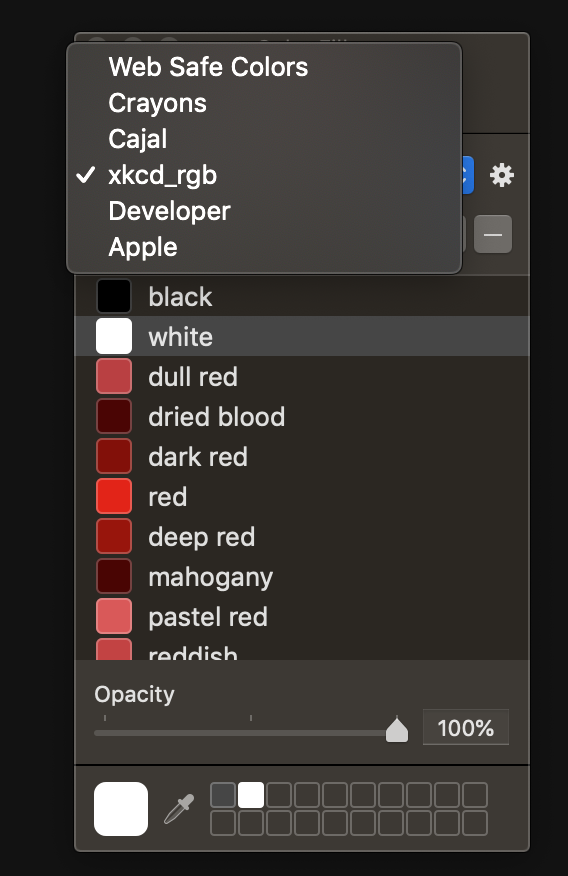

### Convert XKCD colors to Mac palette and load

This project is a quick hack to get custom color lists into the native color picker in macOS.

Briefly, I wanted a way to make the XKCD color list easier to use. 

From : https://xkcd.com/color/rgb.txt

### References

StackOverflow conversation on the tools needed
https://stackoverflow.com/questions/11386513/how-to-create-osx-clr-palette-files

That pointed to this repo:
https://github.com/ramonpoca/ColorTools

I've packaged a release into the tools folder, so this repo is fully-baked, but check out the original source if to see if there are any updates. 


### How to use

Either:

```
clone, run the jupyter-notebook
```

or, if you just want the XKCD colors in clr format

```
1. download the raw file
2. place the file in your Library path @ "~/Library/Colors/xckd_colors.clr"
```


### Goal

